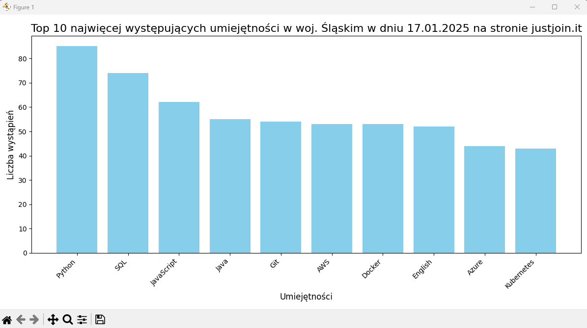

# Scrapowanie Ofert Pracy z JustJoinIT

## Dokumentacja Projektu: Wykorzystanie Scrapy do Analizy Wymaganych Umiejętności

---

## 1. Skład Zespołu i Role
Projekt został zrealizowany przez **Mateusza Marciniuka**, który pełnił następujące role:
- **Inżynier Danych**: Konfiguracja i uruchomienie frameworka Scrapy.
- **Specjalista ds. Scrapowania**: Opracowanie i optymalizacja logiki spidera.
- **Analityk Danych**: Przetwarzanie i wizualizacja zebranych danych.
- **Specjalista ds. Dokumentacji**: Opracowanie i formatowanie dokumentacji projektu.

---

## 2. Tematyka Projektu
Projekt koncentruje się na scrapowaniu danych za pomocą frameworka Scrapy, w celu analizy ofert pracy na stronie [JustJoinIT](https://justjoin.it). 

Celem projektu jest pomoc osobom planującym rozpoczęcie kariery w branży IT w zrozumieniu wymagań rynkowych oraz wyborze technologii do nauki.

---

## 3. Cel Projektu
Celem projektu było:
- Wyodrębnienie umiejętności z ofert pracy na Śląsku.
- Analiza ich częstotliwości.
- Wizualizacja 10 najczęściej wymaganych umiejętności.

---

## 4. Implementacja i Metodyka
Projekt zrealizowano w następujących krokach:
1. **Konfiguracja Scrapy**: Inicjalizacja frameworka i konfiguracja ustawień.
2. **Opracowanie Spidera**: Zbieranie linków do ofert pracy i wyodrębnianie wymaganych umiejętności.
3. **Paginacja**: Dynamiczne ładowanie kolejnych stron ofert.
4. **Przechowywanie Danych**: Zapis umiejętności do pliku CSV.
5. **Analiza Danych**: Agregacja i sortowanie danych.
6. **Wizualizacja**: Wykres słupkowy przedstawiający 10 najczęściej wymaganych umiejętności (biblioteka `matplotlib`).

---

## 5. Zadania i Sposób Ich Realizacji
### Kluczowe zadania:
- Stworzenie spidera do obsługi dynamicznej paginacji i scrapowania danych.
- Wyodrębnianie umiejętności z opisów ofert pracy.
- Zapisanie danych w ustrukturyzowanym formacie CSV.
- Analiza częstości występowania umiejętności.
- Wizualizacja wyników.

### Kod projektu:
Projekt zawiera plik z zależnościami `requirements.txt` umożliwiający instalację bibliotek poleceniem:
```bash
pip install -r requirements.txt
```

---

---

## 6. Problemy Napotkane Podczas Developmentu
### Problem:
- Niekompatybilność selektorów CSS w nowej wersji strony JustJoinIT.

### Rozwiązanie:
Zaktualizowano kod metody `parse`, aby dostosować selektory do nowego układu HTML:
```python
def parse(self, response):
    global len_link
    len_link = len(response.css('a[target="_parent"]::attr(href)').getall())
    links = response.css('a[target="_parent"]::attr(href)').getall()
    for link in links:
        # Logika dla linków
        pass
```

---

## 7. Wizualizacja Wyników
Poniżej znajduje się przykład wykresu słupkowego przedstawiającego 10 najczęściej wymaganych umiejętności w województwie śląskim na dzień **17.01.2025**:



---

## 8. Wnioski
- Scrapy jest skutecznym narzędziem do pozyskiwania wartościowych danych z sieci, nawet w przypadku dynamicznie zmieniających się stron.
- Wyniki analizy mogą pomóc osobom poszukującym pracy w IT zrozumieć wymagania rynkowe i skoncentrować się na najbardziej pożądanych technologiach.
- Projekt może być rozwijany, np. o analizę ofert pracy z innych regionów Polski lub wizualizację danych w czasie.


